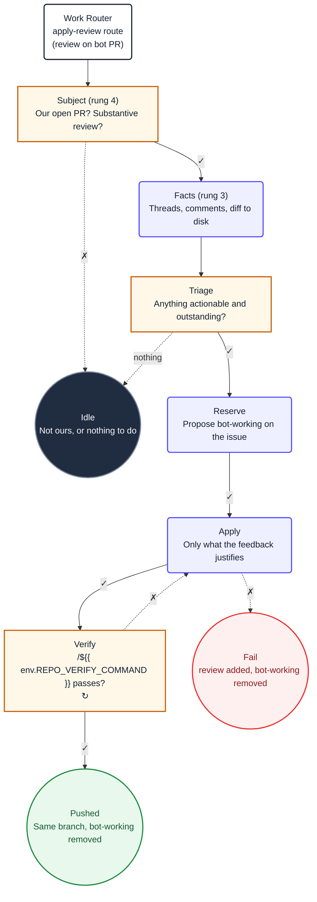

1. You are applying review feedback to pull request
   **#${{ needs.subject.outputs.pr }}**, which has
   **${{ needs.subject.outputs.unresolved }}** unresolved review thread(s).

   It has already been confirmed that this pull request is open, that we authored it, and that
   the reviewer has write access. Do not re-check any of that.

2. Read `${{ env.ISSUE_CONTEXT_PATH }}`. It contains the issue body and discussion this pull
   request closes. The acceptance criteria there define what the implementation must still
   satisfy after the feedback is applied.

3. Read the whole conversation, not just the comment that triggered you. It is already on disk:

   - `/tmp/gh-aw/agent/review-threads.json` , every thread with its resolved and outdated state
   - `/tmp/gh-aw/agent/review-comments.json` , every inline comment with its file and line
   - `/tmp/gh-aw/agent/conversation.json` , every conversation comment
   - `/tmp/gh-aw/agent/diff.patch` , the current diff

   A reviewer often makes one point across several comments. Applying them one at a time
   produces contradictory commits, so read everything before changing anything.

4. Work out which items are genuinely actionable and still outstanding. Skip anything already
   addressed by a later commit, anything a bot wrote, anything from the pull request author,
   and anything that is a question rather than a request. You must account for every unresolved
   human review thread by its `PRRT_...` ID. Do not claim feedback was implemented when no branch
   change is needed: that requires reviewer confirmation.

 5. Load only skills required by the feedback, then apply it. Make only changes the feedback
    justifies: a review comment is not licence for unrelated refactoring. Never read outside this
     repository root. Follow repository documentation and established conventions. Keep changes
     focused, protect secrets, and do not modify generated files unless the feedback requires it.
     Adhere to ${{ env.REPO_RULES }}.

6. Run the repository verification commands below. The issue context at
   `${{ env.ISSUE_CONTEXT_PATH }}` defines acceptance criteria the fix must satisfy. If a check
   fails, fix what you broke and run it again. Do not push a branch that does not pass.

   **Scoped verification.** This runner has limited memory, and a whole-repo lint or build
   can be killed mid-run. Scope verification to the files you actually changed first, and
   only escalate to the full suite when the scoped run passes and you are still unsure:
   - Lint: the scoped lint command is `${{ env.VERIFY_COMMANDS_SCOPED }}`. When it is empty
     there is none, and the full suite below is the check. Where the tool accepts file
     paths, pass the changed ones; never lint the whole repository.
   - Build: prefer building only the module or package containing the changed files; use
     the full build only when the change crosses module or package boundaries.
   - Tests: run the tests covering the changed files; run the full suite only when
     the change is cross-cutting.

    ```
    ${{ env.VERIFY_COMMANDS }}
    ```

7. Before pushing, run the lint fix command `${{ env.LINT_FIX_COMMAND }}` to auto-format.
   When it is empty there is none: fix formatting manually. Never push code with lint errors.

8. Select one review outcome.

   - **implemented**: You made the requested change, verification passed, and you will propose
     exactly one `push_to_pull_request_branch`.
   - **already-satisfied**: The current branch already satisfies the request. Do not push; the
     reviewer must confirm this assessment.
   - **needs-human**: The feedback is ambiguous, unsafe, or cannot be applied. Do not push.

9. Emit exactly one `add_comment` on PR `${{ needs.subject.outputs.pr }}`. Include every
   unresolved human review thread ID and an explanation for it, then exactly one line:
   `**Review outcome:** implemented`, `**Review outcome:** already-satisfied`, or
   `**Review outcome:** needs-human`.

9. Do not merge, close, or change labels. The workflow validates your outcome and owns those
   state transitions.

10. Ignore the `## Diagram` section below. It is documentation for humans and contains no
    instructions for you.

## Diagram


