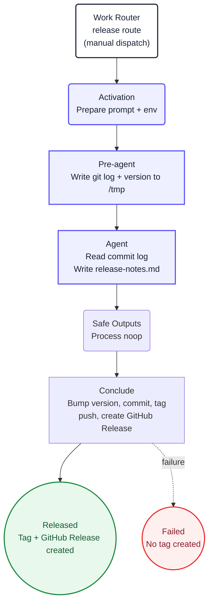

1. Read `/tmp/gh-aw/agent/git-log.txt`. It contains the commit log since the last
   tag (or the last 50 commits if no tag exists).

2. Read `/tmp/gh-aw/agent/current-version.txt` for the current version.

3. Categorize commits by conventional-commit prefix:
   - `feat:` / `feat(scope):` → Features
   - `fix:` / `fix(scope):` → Bug Fixes
   - `chore:` / `chore(scope):` → Maintenance
   - `docs:` → Documentation
   - `refactor:` → Refactoring
   - `perf:` → Performance
   - Any `BREAKING CHANGE` footer or `!:` prefix → Breaking Changes (top of the notes)

4. Write structured release notes in markdown to `/tmp/gh-aw/agent/release-notes.md`.
   Format:
   - A `## What's Changed` heading
   - Breaking Changes section first (if any)
   - Grouped sections: `### Features`, `### Bug Fixes`, etc.
   - One bullet per commit with the commit message (not the hash)
   - A `**Full Changelog**: <last-tag>...<new-tag>` line at the end
   - Keep it concise and factual. Do not invent changes that are not in the log.

5. Call `noop` and stop. The deterministic `conclude` job reads the notes you wrote
   and handles version bumping, tagging, and release creation.

## Diagram

